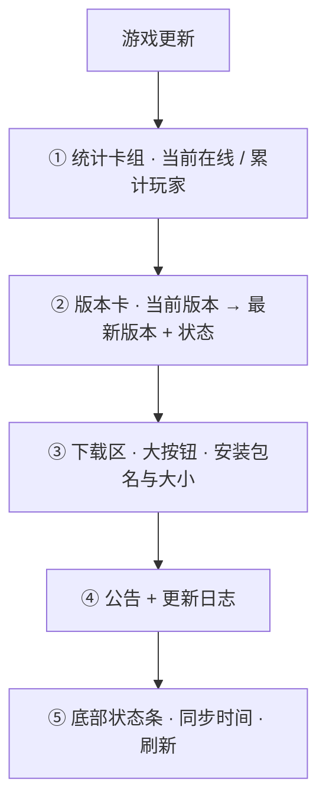
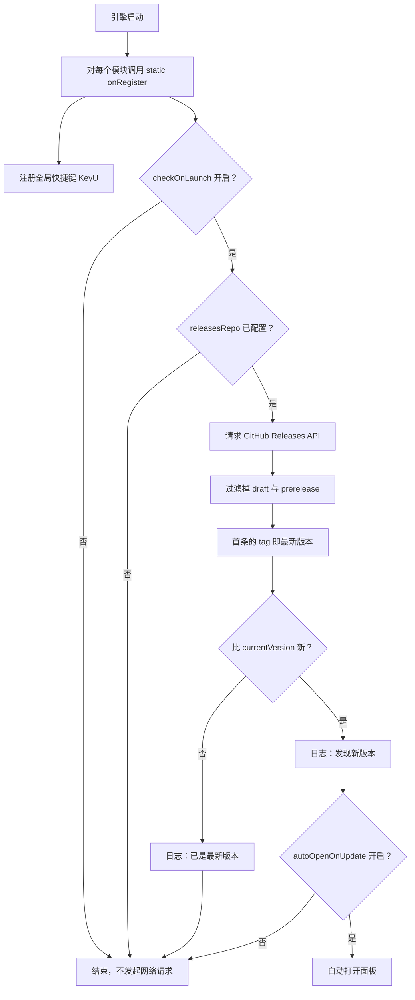
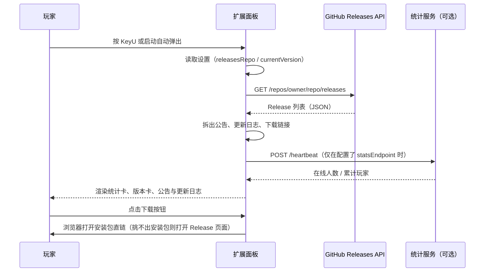

<div align="center">

# online-update

**在游戏内检查版本更新，展示公告、更新日志与下载入口**

[](https://docs.avg-engine.com/extensions/intro)
[](./extension.json)
[](./extension.json)
[](#数据来源release-怎么写)
[](#在线统计预留)

</div>

---

玩家不会主动去翻你的发布页。把「有新版本了」这件事直接送到游戏里，是成本最低的做法。

`online-update` 把更新检查做进游戏本身：引擎一启动就静默比对一次版本，发现有新版就在游戏内弹出面板，玩家点一下就能去下载。更新数据放在 GitHub Releases 里，**不需要自建任何服务器**。

## 目录

- [能力一览](#能力一览)
- [工作流程](#工作流程)
- [快速开始](#快速开始)
- [配置项](#配置项)
- [数据来源：Release 怎么写](#数据来源release-怎么写)
- [在线统计（预留）](#在线统计预留)
- [剧本与快捷键](#剧本与快捷键)
- [目录结构](#目录结构)
- [本地开发](#本地开发)
- [已知限制](#已知限制)

## 能力一览

| 能力 | 说明 |
|---|---|
| 启动期静默检查 | 引擎启动时读一次 GitHub Releases，与当前版本比较，有新版才动作 |
| 游戏内更新面板 | 展示版本对比、公告、更新日志，以及下载入口 |
| 按平台自动挑包 | 一个 Release 里同时放 `.exe` 和 `.apk` 时，按玩家平台直接给对应的安装包直链 |
| 全局快捷键 | 默认 `KeyU`，引擎启动期注册，不用走剧本 |
| 零后端 | 数据直接读 GitHub Releases，无需服务器、数据库或域名 |
| 随作品分发 | 配置存于项目内，随游戏一起打包，玩家不需要做任何设置 |

### 面板结构



| 区块 | 内容 |
|---|---|
| ① 统计卡组 | 「当前在线」「累计玩家」。需要自建统计服务，未配置时显示 `—`，见[在线统计（预留）](#在线统计预留) |
| ② 版本卡 | `当前版本` → `最新版本`，状态在「检查中…」「有新版本」「已是最新」之间切换 |
| ③ 下载区 | 面板的主行动区。标题为「下载最新版本 `3.1.0`」，下方显示安装包文件名与大小，右侧是加大号的下载按钮（有新版时写「前往下载新版本」）。已是最新时标题变成「已是最新版本 `3.1.0`」，按钮写成「重新下载」，配色也从强调色转为灰色。**放在卡片正下方而不是滚动区底部**，避免它被更新日志推到看不见的地方 |
| ④ 公告与日志 | 公告取 Release 标题；更新日志按版本倒序列出，最新一版带「最新」徽标 |
| ⑤ 底部状态条 | 仅保留「同步于 12:34:56」与「刷新」。没有可用下载地址时，左侧显示「暂不提供下载入口」 |

## 工作流程

### 启动时：静默检查



### 打开面板时：取数与渲染



## 快速开始

### 1. 导入扩展

在 Studio 打开 **个性化 → 项目设置**，在左侧扩展树顶部点「导入扩展」，选择本目录或 `.zip` 压缩包（也可以直接把文件夹拖进扩展树）。

本仓库已经把 `dist/index.mjs` 一起提交，**导入后即可使用，不需要先 `npm install`**。

### 2. 准备一个发布 Release 的公开仓库

新建（或复用一个）**公开**仓库，专门用来发布版本。仓库里不需要放任何代码，能打 Release 即可。

### 3. 在 Studio 里填设置

在扩展树中选中 **online-update-58685e → 程序 → 游戏更新**，然后在设置面板里填写下面的字段。至少需要填「GitHub 仓库」。

### 4. 验证

把「当前游戏版本」填成一个比最新 Release 更小的值，重新运行预览，面板应当自动弹出。

无论有没有新版，每次检查都会在**扩展日志**里留一行，所以「检查过了」和「根本没跑」是可以分辨的：

```
[online-update] 发现新版本 0.2.0（当前 0.1.0）
[online-update] 已是最新版本 0.1.0（当前 0.1.0）
```

两行都没有，说明检查根本没有执行 —— 从[配置项](#配置项)逐条检查，绝大多数情况是仓库标识写错、`releasesRepo` 留空，或者仓库还没有正式 Release。

**反向验证**：把「当前游戏版本」改成一个高于最新 Release 的值，重启后应当**不弹面板**，日志显示「已是最新版本」。这一步用来确认版本比较真的生效，而不是无条件弹窗。

## 配置项

| 设置项 | 类型 | 默认值 | 说明 |
|---|---|---|---|
| GitHub 仓库（owner/repo） | 字符串 | 空 | 发布 Release 的公开仓库。接受 `owner/repo`、`https://github.com/owner/repo`、带 `.git` 后缀三种写法。**留空则不检查更新** |
| 当前游戏版本 | 字符串 | `0.1.0` | 本作品当前发布的版本号，用来和最新 Release 的 tag 比较。`v` 前缀可省略 |
| 启动时自动检查更新 | 布尔 | 开启 | 关闭后只在玩家手动打开面板时读取 |
| 发现新版本时自动打开面板 | 布尔 | 开启 | 仅在「启动时自动检查更新」开启时可用 |
| 在线统计服务地址 | 字符串 | 空 | 预留给自建统计服务。留空则两张统计卡显示 `—` |
| 心跳与刷新间隔（秒） | 数字 | `60` | 取值范围 15–600。面板打开期间的上报与刷新间隔 |

> 这些设置随作品打包。玩家拿到的游戏里已经带好配置，玩家侧不需要做任何填写。

## 数据来源：Release 怎么写

扩展只读 GitHub 官方的 Release 数据，字段映射关系如下：

| Release 字段 | 出现在面板的位置 | 说明 |
|---|---|---|
| `tag_name` | 版本号 | `v1.2.0` 与 `1.2.0` 等价 |
| `name` | 公告 | 与 tag 完全相同时不显示，避免标题和版本号重复出现 |
| `body` | 更新日志 | 按行拆条，自动去掉 `#`、`-`、`*`、`1.` 等 Markdown 前缀 |
| `published_at` | 更新日志的日期 | 只取到天 |
| `assets[]` | 「下载」按钮 | 优先用安装包直链，见[安装包与平台匹配](#安装包与平台匹配) |
| `html_url` | 「下载」按钮 | 兜底：挑不出安装包时才指向 Release 页面 |

边界行为：

- **草稿（draft）和预发布（prerelease）会被跳过**，不会提示玩家更新
- 一次最多取最近 **10** 个 Release 作为更新历史，每个版本最多列出 **20** 条变更
- 某条 Release 正文为空时，日志里显示「（该版本未填写更新说明）」
- 仓库里一个正式 Release 都没有时会报错，面板显示「更新信息读取失败」
- 面板中的「当前版本」优先取设置里的值；该值为空时回退到 `0.1.0`

### 一条 Release 的推荐写法

- **Tag**：填版本号，例如 `v0.2.0`
- **Title**：写一句话公告，例如「第二章上线」
- **Description**：写更新日志正文

```markdown
## 新增
- 第二章剧本，约 40 分钟流程
- 鉴赏模式支持按角色筛选

## 修复
- 修复读档后 BGM 不恢复的问题
```

面板会把这些渲染成一行一条的列表，`##` 标题也会作为普通文本保留。

### 安装包与平台匹配

下载按钮**优先指向安装包直链**（`assets[].browser_download_url`），形如：

```
https://github.com/owner/repo/releases/download/v0.2.0/game.exe
```

玩家点一下就开始下载，不用在 Release 页面里自己翻找文件。按钮下方会显示文件名和大小，例如 `game.exe · 128.4 MB`。

一个 Release 里可以同时放 Windows 和 Android 两个包，扩展会**按玩家所在平台自动挑**，不需要额外配置：

| 玩家平台 | 匹配优先级（取第一个命中的） |
|---|---|
| Windows | `.exe` → `.msi` → `.zip` |
| Android | `.apk` → `.zip` |
| macOS | `.dmg` → `.pkg` → `.zip` |
| Linux | `.AppImage` → `.deb` → `.tar.gz` → `.zip` |

平台由运行环境的 UA 判断。`.exe` 外壳和 `.apk` 的 WebView 都会留下平台特征，所以这一步是自动的。

**挑不出匹配项时**：只有一个包就直接给它；有多个包却认不出平台，则退回 Release 页面让玩家自己选——总比让安卓玩家下到 `.exe` 好。

> **注意**：匹配只看文件后缀，**不区分 CPU 架构**。如果你的命名里带架构（如 `game-win-x64.exe` 与 `game-win-arm64.exe` 并存），扩展会取列表中靠前的那个。这种情况建议只上传一个架构的包，或改用 Release 页面兜底。

## 在线统计（预留）

面板顶部的两张统计卡需要一个自建的统计服务，当前项目**没有提供可用后端**，`statsEndpoint` 留空时它们显示 `—`，这是预期行为。

如果你日后自建服务，扩展约定的接口是：

| 方法 | 路径 | 请求体 | 期望响应 |
|---|---|---|---|
| `GET` | `{statsEndpoint}/stats` | — | `{ "online": 12, "total": 340 }` |
| `POST` | `{statsEndpoint}/heartbeat` | `{ "playerId": "…" }` | 任意成功响应 |

几个已实现的行为：

- 面板**打开期间**才按间隔上报心跳，面板关闭即停止
- 玩家标识 `playerId` 在首次打开面板时随机生成，以 `shared` 作用域持久化，跨存档保持不变
- 统计读取失败不会影响更新功能，只在面板里显示一条警告

## 剧本与快捷键

### 快捷键

`KeyU` 在引擎启动期通过 `static onRegister` 注册，属于全局快捷键，**不依赖剧本**，游戏运行中随时可按。

### 剧本指令：显示界面

面板同时注册为一个可显示的界面，引用路径为 `online-update-58685e/panel`。在剧本里使用「显示界面」指令并选中「游戏更新」，就能让它在指定剧情节点出现；该指令可以覆盖面板标题。

> 更新检查**不依赖**这条指令——它在引擎启动期就已经跑完了。剧本指令只是给玩家一个主动查看更新日志的入口，按需使用。

## 目录结构

```
.
├── extension.json                扩展清单：id / 版本 / 入口 / 最低 SDK
├── src/
│   ├── index.tsx                 入口：设置声明、启动检查、快捷键注册
│   ├── online-update-panel.tsx   面板 UI
│   └── remote-api.ts             取数与解析：GitHub Releases、版本比较
├── dist/index.mjs                构建产物，extension.json 的 entry 指向它
├── dist/index.js                 同一份产物的副本，兼容按旧约定取件的宿主
├── sdk/                          Studio 同步出的 SDK 接口副本（不入库）
├── vite.config.ts                构建配置：lib 模式，ESM 输出
└── .gitignore
```

## 本地开发

```bash
npm install      # 安装依赖，并把 sdk/ 链接为 @avg-studio/sdk
npm run build    # 单次构建到 dist/
npm run watch    # 监听 src/ 变化并增量构建
```

当前脚手架**没有** `npm run dev` 命令，监听构建请用 `npm run watch`。

改动源码后，有几种方式让它生效：

1. 在扩展树中右键选择「构建扩展（自动装依赖）」
2. 终端运行 `npm run watch`，Studio 会在约 200ms 内接住 `dist/` 的变化
3. 手动 `npm run build`，然后在扩展树点「刷新扩展程序」

> 改完 TypeScript **不等于**游戏已经加载新代码。Studio 用的是项目内的**项目发行物**快照，只有构建产物同步之后才会生效。

## 已知限制

| 限制 | 说明 |
|---|---|
| 在线统计无可用后端 | 见[在线统计（预留）](#在线统计预留)。当前只有接口约定，没有配套服务 |
| GitHub API 限流 | 未登录时每 IP 每小时 60 次，一次启动检查消耗 1 次。日常使用很难撞到，但同一出口 IP 下的玩家数量很大时可能失败 |
| 不自动下载或替换游戏文件 | 扩展没有文件写入权限，也不应替玩家决定。它只负责提示，并把浏览器指向下载入口 |
| 下载链接仍在 GitHub 域名下 | 直链是 `github.com`，点击后 302 跳到 `objects.githubusercontent.com`。国内对这两个域名的可达性都不稳定，**改成直链只是少一步跳转，并不解决访问问题**。要彻底解决需要自建镜像或 CDN |
| 安装包匹配不区分 CPU 架构 | 只按后缀匹配。同平台多架构（`x64` / `arm64`）并存时会取列表中靠前的那个，见[安装包与平台匹配](#安装包与平台匹配) |
| 启动提示不去重 | 玩家在完成更新之前，每次启动都会看到提示。启动检查没有可用的持久化通道来做「已提示过」标记 |
| 版本号需要手动维护 | 扩展读不到游戏的真实版本，`currentVersion` 由创作者填写。发新版本时记得同步更新这个值，否则不会提示更新 |

## 相关链接

- [LetsGal Studio 扩展开发文档](https://docs.avg-engine.com/extensions/intro)
- [Extension 基类](https://docs.avg-engine.com/extensions/extension-class)
- [GitHub Releases API](https://docs.github.com/en/rest/releases/releases)
